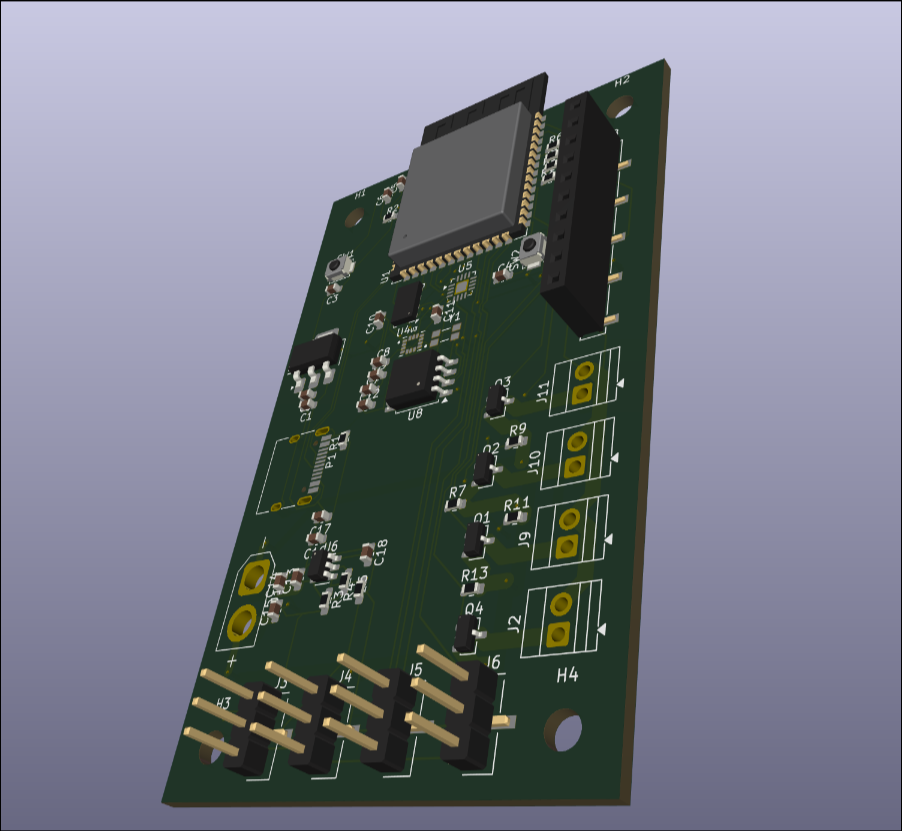
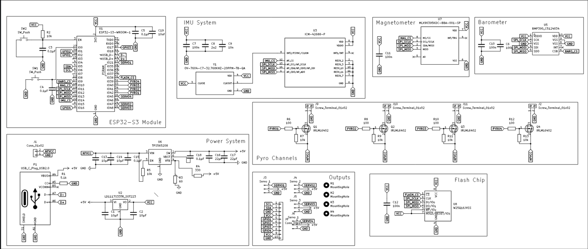
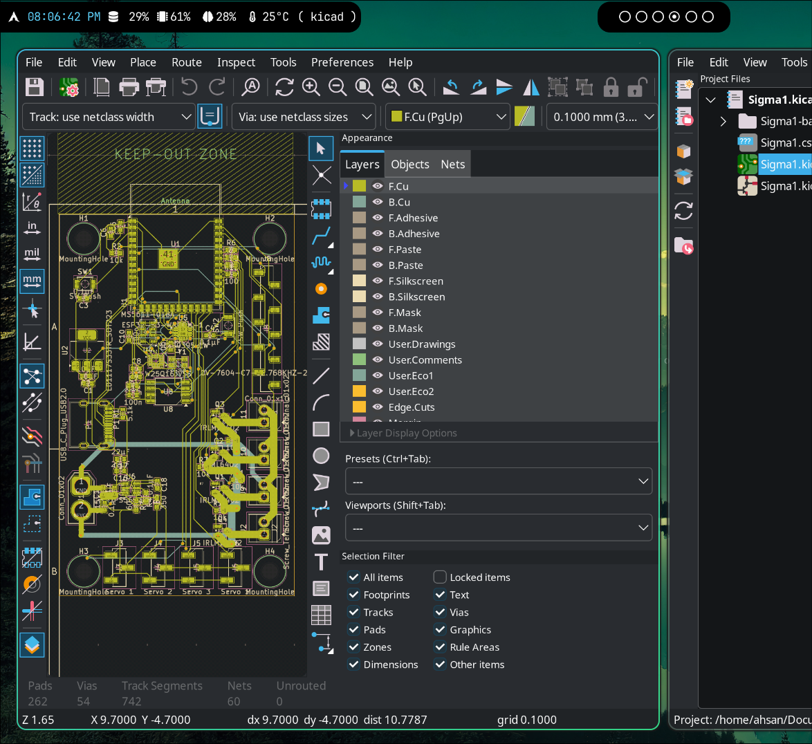

# MANGO
An ESP32-S3 based flight computer with an external flash, imu, barometer, magnetometer, 4 servo ports, and 4 pyrotechnic channels with MOSFETs. Designed for Aerospace applications.

## Key Features
 - Dual core Xtensa microcontroller
 - 4 Servo Outputs
 - 4 High current mosfet switches for pyrotechnic channels
 - External 16 MB flash for flight logging
 - IMU, Magnetometer, and Barometer for orientation and state estimation
 - External expansion header with space for an I2C bus, 4 extra GPIO pins, and 2 pairs of power

## Schematic

## PCB

